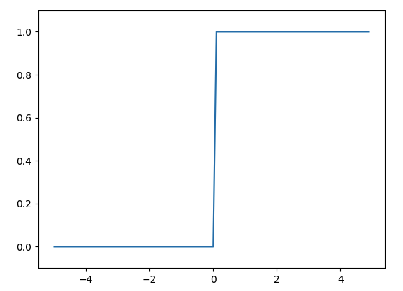
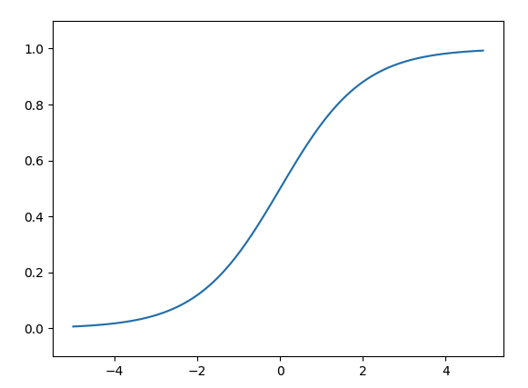
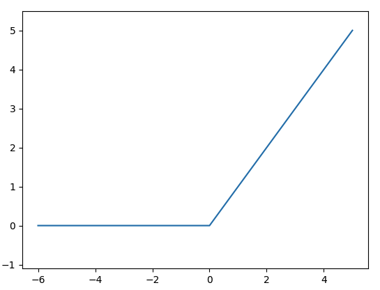

신경망은 입력층과 은닉층, 출력층이 존재함
x1, x2라는 값이 주어지고 가중치가 w1, w2일 때 출력은

$$
y = \begin{cases} 
  0 (b+W_1X_1 + W_2X_2 \leq 0)\\
  1 (b+W_1X_1 + W_2X_2 > 0)
\end{cases}
$$

아래 수식처럼 표현 가능하다
여기서 b는 편향을 나타내는 매개변수로, 뉴런이 얼마나 쉽게 활성화되는냐를 제어한다.
편향을 명시한 퍼셉트론에서는 가중치가 b이고 입력이 1인 뉴런이 추가된다.
함수 h(x)를 표현

$$
y = h(b+ W_1X_1 + W_2X_2)\\
h(x) = y = \begin{cases} 
  0 (X\leq 0)\\
  1 (X > 0)
\end{cases}
$$

입력 신호의 총합이 h(x)라는 함수를 거쳐 변환되어, 그 변환된 값이 y의 출력이 됨을 보여준다. 입력이 0을 넘으면 1을 반환
그렇지 않으면 0을 반환한다
입력 신호의 총합을 출력신호로 변환하는 함수 → 활성화 함수
활성화 함수는 입력 신호 총합이 활성화를 일으키는지를 정하는 역할을 합니다.

$$
h(x) = {1 \over 1 + exp(-x)}
$$

활성화 함수는 임계값을 경계로 출력이 바뀌는데, 이런 함수를 계단 함수라고 한다.
계단 함수 그래프


## 시그모이드 함수

시그모이드 함수의 수식이다. exp(-x)는 e^-x을 의미한다.


### 시그모이드 함수와 계단 함수의 차이점

매끄러움의 차이와 출력 값의 차이

매끄러움은 신경항 학습에서 중요한 부분임 / 출력값의 차이는 계단 함수는 0또는 1의 출력 값만 가지지만, 시그모이드 함수는 0.8123, 0.3 등 다양한 실수 값이 출력될 수 있음
두 함수는 비선형 함수인데 이 뜻은 직선 1개로 그릴 수 없는 그래프를 말하는 것
신경망에서는 활성화 함수로는 비선형 함수로 사용해야한다. 
선형 함수인 h(x) = cx를 활성화 함수로 사용한 3층 네트워크는 수식적으로 y(x) = h(h(h(x)))가 된다. 이 계산은 y(x) = c * c * c * x처럼 곱셈을 3번 하지만
y(x) = ax( a= c^3)인 식과 동일하다. 따라서 선형 함수를 사용하게되면, 은닉층이 없는 네트워크로 표현할 수 있다. 

## ReLU 함수

입력이 0이하면 모두 0을 반환, 0 초과이면 값을 그대로 반환
수식으로 표현하면 이런 식으로 표현 가능
$$
h(x) = \begin{cases} 
  0 (x\leq 0)\\
  1 (x > 0)
\end{cases}
$$


--------------------------------------------------------------------------------
# 출력층 설계
회귀에는 항등 함수,분류에는 소프트맥스 함수 사용
항등 함수 : 입력은 그대로 반환

### 소프트 맥스 함수의 수식
$$
y_k = {exp(a_k) \over \overset{n}{ \underset{i=1}{\sum}}exp(a_i)}
$$
n은 출력층의 뉴런 수, Yk는 그 중 k번째 출력
하지만 위의 방식은 오버플로우 가능성이 매우 높음
그래서 식에 임의의 정수 c를곱해 해결 (유도과정 생략)

오버플로우 문제를 해결한 수식
$$
y_k = {exp(a_k + C') \over \overset{n}{ \underset{i=1}{\sum}}exp(a_i + C')}(C'=logC)
$$

소프트맥스 함수의 출력값은 0과 1사이의 소수이며, 출력값의 총합은 1이라는 성질을 가지고 있다.
출력값이 소수라는 점을 통해 확률적으로 해석이 가능하다.
또한 exp(e^x)는 단조 증가 함수이기에 대소 관계 변화는 없다.

## 손글씨 숫자 인식
Mnist 데이터 셋을 이용
load_mnist 함수는 데이터를 (훈련 이미지, 훈련 레이블), (시험 이미지, 시험 레이블)로 불러옴
인수는 normalize, flatten, one_hot_label
normalize : 입력 이미지의 픽셀 값을 0.0 ~ 1.0 사이로 정규화, False로 설정하면 원래 크기인 0 ~ 255 사이의 값
flatten : 입력 이미지 데이터를 평탄하게(1차원 형태로) 만듦
one_hot_label : one-hot-encoding(정답인 데이터만 1, 나머지는 0인 형태) 형태로 저장할지를 설정

### 배치처리
묶어서 처리하는 것
```python
# 생략
def predict(network, x):
    #입력 이미지를 받아 예측값을 반환

    W1, W2, W3 = network['W1'], network['W2'], network['W3'] # Weight
    b1, b2, b3 = network['b1'], network['b2'], network['b3'] # Bais

    #첫 번째 은닉층
    a1 = np.dot(x, W1) + b1
    z1 = sigmoid(a1)

    #두 번째 은닉층
    a2 = np.dot(z1, W2) + b2
    z2 = sigmoid(a2)

    #출력층
    a3 = np.dot(z2, W3) + b3
    
    #출력값을 확률로 변환
    y = softmax(a3)
    
    return y
```

위 코드에서 예시를 들자면 원소가 784개인 1차원 배열의 입력이 일련의 과정을 거쳐 원소가 10개인 1차원 배열로 출력된다.(입력 부분은 생략)
이 과정이 이미지 1개에 대한 과정이다.
이미지를 한꺼번에 100장을 넘긴다면 100장에 대한 출력이 한 번에 이루어진다.

배치의 장점은 이미지 1장당 처리 시간을 줄여준다. 이유는 2가지
1. 수치 계산 라이브러리는 큰 배열을 빠르게 처리할 수 있도록 발달 되어있음.
2. 버스(데이터가 이동하는 통로)에 주는 부하를 줄인다.